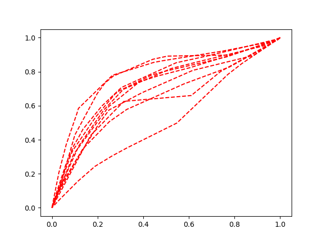
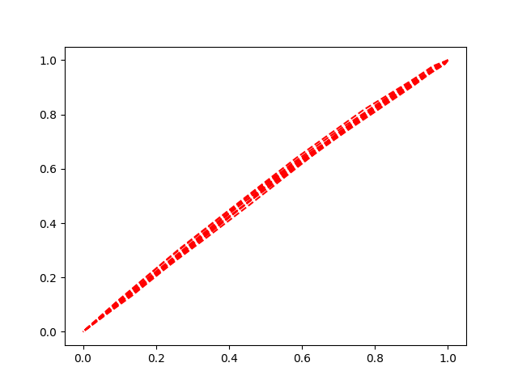
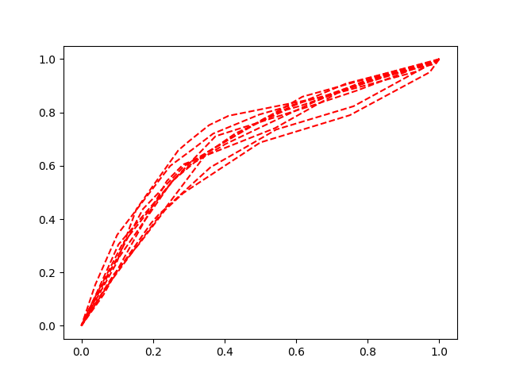
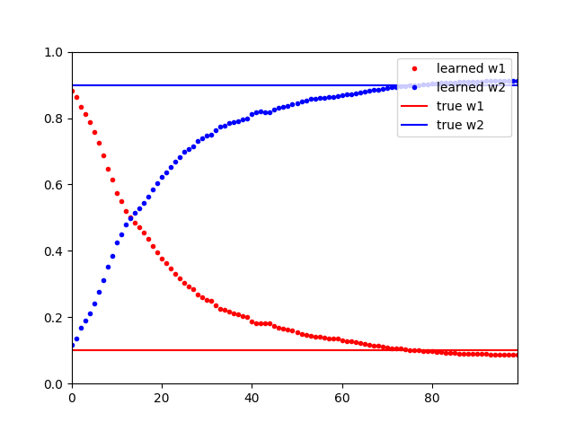

# Inverse reinforcement learning using RRT*
Simple inverse reinforcement learning using RRT as trajectory sampling algorithm. The cost function is linear in features and the gradient at each iteration is the expected difference in agent and expert feature vector. The RRT implementation is from [Python Robotics](https://github.com/AtsushiSakai/PythonRobotics).

# Usage
```bash
cd scripts
python3 irl_rrt_train.py
```

The task is to navigate from start (0, 0) to goal (1, 1). There are two features for each state: 1. distance to goal at (1, 1) and 2. distance to an attractor at (0, 1). The true weights are (0.1, 0.9), which is used by the expert to generate demonstrations. As a result, the sampled expert trajectories bend upwards. 



The learned weight is initialized at (0.9, 0.1) which results in almost straight paths from start to goal. 



After training the sampled agent paths look like



The figure below shows the learned and true weights during training. 


